## Deploying the Project on AWS EC2

Welcome to the AWS EC2 deployment guide for our project! This comprehensive tutorial will walk you through the entire process of deploying your application on an AWS EC2 instance. By following these steps, you'll set up a robust and scalable environment tailored to your project's needs.

### What You'll Learn

- **AWS Account Registration:** How to create and set up your AWS account.
- **Selecting the Right Region:** Choosing the optimal AWS region for your deployment.
- **Launching an EC2 Instance:** Step-by-step instructions to create and configure your virtual machine.
- **Configuring Security Groups:** Managing firewall settings to secure your instance.
- **Assigning a Static IP Address (Elastic IP):** Ensuring your instance retains a consistent public IP.
- **Connecting to Your EC2 Instance:** Using SSH clients like MobaXterm for secure access.
- **Setting Up Swap Space:** Enhancing your instance's performance by adding swap memory.
- **Installing Docker Engine:** Deploying your application using Docker for streamlined management.
- **Cloning Your Repository and Launching the Project:** Bringing your code to life on the cloud.

### Prerequisites

Before you begin, ensure you have the following:

- **AWS Account:** If you don't have one, [register here](https://aws.amazon.com/console/).
- **SSH Key Pair (`.pem` file):** Generated during the EC2 instance setup for secure access.
- **Basic Knowledge of Linux Commands:** Familiarity with terminal operations will be beneficial.
- **Docker Knowledge (Optional):** Understanding Docker can help in managing containers effectively.

### Important Notes

- **Free Tier Eligibility:** This guide utilizes AWS services that are eligible for the free tier. Be mindful of the usage limits to avoid unexpected charges.
- **Security Best Practices:** Always follow security best practices, such as restricting SSH access to trusted IP addresses and regularly updating your instance.
- **Resource Management:** Monitor your instance's performance and resource usage to ensure optimal operation.

Absolutely! Below is the translated and enhanced section for your README that outlines the project's directory structure. This section includes a visual tree diagram and detailed descriptions of each file and directory to help users understand the project's organization and components.

---

## Project Directory Structure

Understanding the project's directory structure is crucial for navigating and managing the codebase effectively. Below is a comprehensive overview of the project's layout, along with descriptions for each file and directory.

### Directory Tree

```plaintext
.
├── Dockerfile
├── README.MD
├── alembic.ini
├── commands
│   ├── run_migration.sh
│   ├── run_web_server_dev.sh
│   ├── run_web_server_prod.sh
│   ├── set_nginx_basic_auth.sh
│   ├── setup_mailhog_auth.sh
│   └── setup_minio.sh
├── configs
│   └── nginx
│       └── nginx.conf
├── docker
│   ├── mailhog
│   │   └── Dockerfile
│   ├── minio_mc
│   │   └── Dockerfile
│   ├── nginx
│   │   └── Dockerfile
│   └── tests
│       └── Dockerfile
├── docker-compose-dev.yml
├── docker-compose-prod.yml
├── docker-compose-tests.yml
├── init.sql
├── poetry.lock
├── pyproject.toml
├── pytest.ini
└── src
    ├── config
    │   ├── __init__.py
    │   ├── dependencies.py
    │   └── settings.py
    ├── database
    │   ├── __init__.py
    │   ├── migrations
    │   │   ├── README
    │   │   ├── env.py
    │   │   ├── script.py.mako
    │   │   └── versions
    │   │       ├── 2da0dc469be8_temp_migration.py
    │   │       ├── 32b1054a69e3_initial_migration.py
    │   │       └── 41cdafa531cf_temp_migration.py
    │   ├── models
    │   │   ├── __init__.py
    │   │   ├── accounts.py
    │   │   ├── base.py
    │   │   └── movies.py
    │   ├── populate.py
    │   ├── seed_data
    │   │   ├── imdb_movies.csv
    │   │   └── test_data.csv
    │   ├── session_postgresql.py
    │   ├── session_sqlite.py
    │   ├── source
    │   │   └── theater.db
    │   └── validators
    │       ├── __init__.py
    │       └── accounts.py
    ├── exceptions
    │   ├── __init__.py
    │   ├── email.py
    │   ├── security.py
    │   └── storage.py
    ├── main.py
    ├── notifications
    │   ├── __init__.py
    │   ├── emails.py
    │   ├── interfaces.py
    │   └── templates
    │       ├── activation_complete.html
    │       ├── activation_request.html
    │       ├── password_reset_complete.html
    │       └── password_reset_request.html
    ├── routes
    │   ├── __init__.py
    │   ├── accounts.py
    │   ├── movies.py
    │   └── profiles.py
    ├── schemas
    │   ├── __init__.py
    │   ├── accounts.py
    │   ├── examples
    │   │   ├── __init__.py
    │   │   └── movies.py
    │   ├── movies.py
    │   └── profiles.py
    ├── security
    │   ├── __init__.py
    │   ├── http.py
    │   ├── interfaces.py
    │   ├── passwords.py
    │   ├── token_manager.py
    │   └── utils.py
    ├── storages
    │   ├── __init__.py
    │   ├── interfaces.py
    │   └── s3.py
    ├── tests
    │   ├── __init__.py
    │   ├── conftest.py
    │   ├── doubles
    │   │   ├── __init__.py
    │   │   ├── fakes
    │   │   │   ├── __init__.py
    │   │   │   └── storage.py
    │   │   └── stubs
    │   │       ├── __init__.py
    │   │       └── emails.py
    │   ├── test_e2e
    │   │   ├── __init__.py
    │   │   ├── test_email_notification.py
    │   │   └── test_storage.py
    │   └── test_integration
    │       ├── __init__.py
    │       ├── test_accounts.py
    │       ├── test_movies.py
    │       └── test_profiles.py
    └── validation
        ├── __init__.py
        └── profile.py
```

### Directory and File Descriptions

Below is a detailed description of each directory and its contents to help you navigate and understand the project's structure.

#### Root Directory (`.`)

- **`Dockerfile`**: Defines the Docker image configuration for the application, including base image, dependencies, and startup commands.
- **`README.MD`**: The main documentation file providing an overview, setup instructions, and usage guidelines for the project.
- **`alembic.ini`**: Configuration file for Alembic, a database migration tool used with SQLAlchemy.
- **`init.sql`**: SQL script for initializing the database with necessary tables and data.

#### `commands/`

Contains shell scripts that automate various tasks related to the project.

- **`run_migration.sh`**: Executes database migrations using Alembic to update the database schema.
- **`run_web_server_dev.sh`**: Starts the web server in development mode, typically with debugging enabled.
- **`run_web_server_prod.sh`**: Starts the web server in production mode, optimized for performance and security.
- **`set_nginx_basic_auth.sh`**: Configures Nginx with Basic Authentication to secure specific endpoints.
- **`setup_mailhog_auth.sh`**: Sets up authentication for MailHog, an email testing tool.
- **`setup_minio.sh`**: Configures MinIO, an object storage server compatible with Amazon S3 APIs.

#### `configs/nginx/`

Holds configuration files for Nginx, the web server used to serve the application.

- **`nginx.conf`**: The main Nginx configuration file that sets up server blocks, proxy settings, and security configurations like Basic Authentication.

#### `docker/`

Contains Dockerfiles for various services used in the project, facilitating containerization and orchestration.

- **`mailhog/Dockerfile`**: Dockerfile for setting up the MailHog email testing tool.
- **`minio_mc/Dockerfile`**: Dockerfile for configuring MinIO client tools.
- **`nginx/Dockerfile`**: Dockerfile for building the custom Nginx image with necessary configurations and scripts.
- **`tests/Dockerfile`**: Dockerfile for setting up the testing environment, ensuring consistency across different environments.

#### Docker Compose Files

Manage multi-container Docker applications, defining services, networks, and volumes.

- **`docker-compose-dev.yml`**: Configuration for the development environment, including services, volumes, and ports tailored for development workflows.
- **`docker-compose-prod.yml`**: Configuration for the production environment, optimized for performance, security, and scalability.
- **`docker-compose-tests.yml`**: Configuration for running tests within Docker containers, ensuring isolation and consistency during testing.

#### `src/`

The core source code of the application, organized into various modules and components for maintainability and scalability.

##### `src/config/`

Handles application configurations and dependencies.

- **`__init__.py`**: Initializes the `config` module.
- **`dependencies.py`**: Defines dependencies for the application, often used with FastAPI for dependency injection.
- **`settings.py`**: Manages application settings, possibly using environment variables for configuration.

##### `src/database/`

Manages database interactions, migrations, and models.

- **`__init__.py`**: Initializes the `database` module.
- **`migrations/`**: Contains Alembic migration scripts to manage database schema changes.
  - **`README`**: Documentation related to database migrations.
  - **`env.py`**: Alembic environment configuration.
  - **`script.py.mako`**: Template for generating migration scripts.
  - **`versions/`**: Contains individual migration scripts.
    - **`2da0dc469be8_temp_migration.py`**: Temporary migration script.
    - **`32b1054a69e3_initial_migration.py`**: Initial migration script setting up the base schema.
    - **`41cdafa531cf_temp_migration.py`**: Another temporary migration script.
- **`models/`**: Defines the database models using SQLAlchemy.
  - **`__init__.py`**: Initializes the `models` module.
  - **`accounts.py`**: Defines the `Account` model and related database structures.
  - **`base.py`**: Base model definitions and common configurations.
  - **`movies.py`**: Defines the `Movie` model and related database structures.
- **`populate.py`**: Script to populate the database with initial data.
- **`seed_data/`**: Contains CSV files used for seeding the database.
  - **`imdb_movies.csv`**: Seed data for movies, possibly sourced from IMDb.
  - **`test_data.csv`**: Additional seed data for testing purposes.
- **`session_postgresql.py`**: Manages PostgreSQL database sessions.
- **`session_sqlite.py`**: Manages SQLite database sessions for development or testing.
- **`source/`**
  - **`theater.db`**: SQLite database file used in development or testing environments.
- **`validators/`**: Contains data validation logic.
  - **`__init__.py`**: Initializes the `validators` module.
  - **`accounts.py`**: Validation functions and classes for account-related data.

##### `src/exceptions/`

Defines custom exception classes to handle various error scenarios within the application.

- **`__init__.py`**: Initializes the `exceptions` module.
- **`email.py`**: Exceptions related to email operations.
- **`security.py`**: Exceptions related to security and authentication.
- **`storage.py`**: Exceptions related to storage and file handling.

##### `src/main.py`

The main entry point of the application, typically initializing the FastAPI app, including middleware, routers, and other configurations.

##### `src/notifications/`

Handles email notifications and related functionalities.

- **`__init__.py`**: Initializes the `notifications` module.
- **`emails.py`**: Functions and classes for sending emails.
- **`interfaces.py`**: Defines interfaces or abstract classes for notification services.
- **`templates/`**: HTML templates used for email notifications.
  - **`activation_complete.html`**: Template for activation completion emails.
  - **`activation_request.html`**: Template for activation request emails.
  - **`password_reset_complete.html`**: Template for password reset completion emails.
  - **`password_reset_request.html`**: Template for password reset request emails.

##### `src/routes/`

Defines the API endpoints and their respective handlers.

- **`__init__.py`**: Initializes the `routes` module.
- **`accounts.py`**: Routes related to user accounts (e.g., registration, login).
- **`movies.py`**: Routes related to movie data (e.g., listing, details).
- **`profiles.py`**: Routes related to user profiles.

##### `src/schemas/`

Defines the data schemas using Pydantic for request validation and response models.

- **`__init__.py`**: Initializes the `schemas` module.
- **`accounts.py`**: Schemas for account-related operations.
- **`examples/`**: Contains example schemas used for documentation or testing.
  - **`__init__.py`**: Initializes the `examples` module.
  - **`movies.py`**: Example schemas for movie data.
- **`movies.py`**: Schemas for movie-related operations.
- **`profiles.py`**: Schemas for profile-related operations.

##### `src/security/`

Manages authentication, authorization, and security-related functionalities.

- **`__init__.py`**: Initializes the `security` module.
- **`http.py`**: Handles HTTP security configurations, possibly OAuth or JWT setups.
- **`interfaces.py`**: Defines interfaces for security components.
- **`passwords.py`**: Functions for hashing and verifying passwords.
- **`token_manager.py`**: Manages token creation, validation, and refreshing.
- **`utils.py`**: Utility functions related to security.

##### `src/storages/`

Handles file storage, interfacing with storage services like Amazon S3.

- **`__init__.py`**: Initializes the `storages` module.
- **`interfaces.py`**: Defines interfaces for storage services.
- **`s3.py`**: Implements storage functionalities using Amazon S3 APIs.

##### `src/tests/`

Contains all test cases to ensure the application's reliability and correctness.

- **`__init__.py`**: Initializes the `tests` module.
- **`conftest.py`**: Configuration file for pytest, defining fixtures and plugins.
- **`doubles/`**: Contains test doubles like fakes and stubs for mocking dependencies.
  - **`__init__.py`**: Initializes the `doubles` module.
  - **`fakes/`**: Implements fake objects for testing.
    - **`__init__.py`**: Initializes the `fakes` module.
    - **`storage.py`**: Fake storage implementations for tests.
  - **`stubs/`**: Implements stubs for testing.
    - **`__init__.py`**: Initializes the `stubs` module.
    - **`emails.py`**: Stub implementations for email functionalities.
- **`test_e2e/`**: End-to-End test cases.
  - **`__init__.py`**: Initializes the `test_e2e` module.
  - **`test_email_notification.py`**: Tests for email notification flows.
  - **`test_storage.py`**: Tests for storage functionalities.
- **`test_integration/`**: Integration test cases.
  - **`__init__.py`**: Initializes the `test_integration` module.
  - **`test_accounts.py`**: Integration tests for account-related operations.
  - **`test_movies.py`**: Integration tests for movie-related operations.
  - **`test_profiles.py`**: Integration tests for profile-related operations.

##### `src/validation/`

Contains validation logic to ensure data integrity and correctness.

- **`__init__.py`**: Initializes the `validation` module.
- **`profile.py`**: Validation functions and classes for profile data.


This directory structure is thoughtfully organized to promote maintainability, scalability, and clarity. Here's a quick overview:

- **Configuration and Commands**: 
  - `commands/`: Automates routine tasks like migrations and server setup.
  - `configs/nginx/`: Houses Nginx configuration files.
  
- **Docker Setup**:
  - `docker/`: Contains Dockerfiles for various services ensuring consistent containerization.
  - `docker-compose-*.yml`: Manages multi-container Docker applications for different environments (development, production, testing).
  
- **Source Code (`src/`)**:
  - Organized into submodules like `config`, `database`, `routes`, `schemas`, `security`, `storages`, `notifications`, `exceptions`, and `validation` to separate concerns and enhance code readability.
  
- **Testing**:
  - `src/tests/`: Structured to support both End-to-End and Integration testing, utilizing test doubles for isolated testing scenarios.
  
- **Dependencies and Setup**:
  - `poetry.lock` & `pyproject.toml`: Manage Python dependencies using Poetry.
  - `alembic.ini`: Configure database migrations with Alembic.
  
- **Miscellaneous**:
  - `init.sql`: Initial SQL setup script.
  - `README.MD`: Project documentation.

Certainly! Below is a comprehensive explanation of your `docker-compose-prod.yml` configuration and its associated files. This section is tailored for inclusion in your project's README, providing clear insights into each service, its purpose, and how it contributes to the overall deployment.

---

## Docker Compose Configuration (`docker-compose-prod.yml`)

The `docker-compose-prod.yml` file orchestrates multiple Docker containers to create a robust and scalable production environment for your application. Each service defined within this file serves a specific role, ensuring that all components of your application work seamlessly together.

### Overview of Services

Here's a breakdown of each service defined in the `docker-compose-prod.yml` file:

1. [**db**](#db-service)
2. [**pgadmin**](#pgadmin-service)
3. [**web**](#web-service)
4. [**migrator**](#migrator-service)
5. [**mailhog**](#mailhog-service)
6. [**minio**](#minio-service)
7. [**minio_mc**](#minio_mc-service)
8. [**nginx**](#nginx-service)
9. [**Volumes**](#volumes)
10. [**Networks**](#networks)

---

### db Service

```yaml
db:
  image: 'postgres:latest'
  container_name: postgres_theater
  env_file:
    - .env
  ports:
    - "5432:5432"
  volumes:
    - ./init.sql:/docker-entrypoint-initdb.d/init.sql
    - postgres_theater_data:/var/lib/postgresql/data/
  networks:
    - theater_network
  healthcheck:
    test: [ "CMD-SHELL", "pg_isready -U $POSTGRES_USER -d $POSTGRES_DB -h 127.0.0.1 || exit 1" ]
    interval: 10s
    timeout: 5s
    retries: 5
    start_period: 20s
```

- **Purpose:**  
  Hosts the PostgreSQL database required by your application.

- **Key Configurations:**
  - **Image:** Uses the latest PostgreSQL Docker image.
  - **Container Name:** Named `postgres_theater` for easy identification.
  - **Environment Variables:** Loaded from the `.env` file to configure database credentials and settings.
  - **Ports:** Maps the container's port `5432` to the host's port `5432`, allowing external access if needed.
  - **Volumes:**
    - `./init.sql:/docker-entrypoint-initdb.d/init.sql`: Executes the `init.sql` script on container initialization to set up the database schema and seed data.
    - `postgres_theater_data:/var/lib/postgresql/data/`: Persists PostgreSQL data, ensuring data retention across container restarts.
  - **Networks:** Connected to the `theater_network` for inter-service communication.
  - **Healthcheck:** Uses `pg_isready` to verify the database is ready to accept connections, enhancing reliability by ensuring dependent services wait until the database is operational.

---

### pgadmin Service

```yaml
pgadmin:
  image: dpage/pgadmin4
  container_name: pgadmin_theater
  ports:
    - "3333:80"
  env_file:
    - .env
  depends_on:
    db:
      condition: service_healthy
  volumes:
    - pgadmin_theater_data:/var/lib/pgadmin
  networks:
    - theater_network
```

- **Purpose:**  
  Provides a web-based interface for managing the PostgreSQL database, making database administration more accessible.

- **Key Configurations:**
  - **Image:** Utilizes the official `pgadmin4` Docker image.
  - **Container Name:** Named `pgadmin_theater`.
  - **Ports:** Maps container port `80` to host port `3333`, allowing access to PgAdmin via `http://<EC2-Public-IP>:3333`.
  - **Environment Variables:** Loaded from the `.env` file to configure PgAdmin credentials and settings.
  - **Depends On:** Waits for the `db` service to become healthy before starting, ensuring the database is ready for management tasks.
  - **Volumes:** Persists PgAdmin data to `pgadmin_theater_data`, retaining configurations and user data.
  - **Networks:** Connected to the `theater_network` for seamless interaction with the `db` service.

---

### web Service

```yaml
web:
  restart: always
  build: .
  container_name: backend_theater
  command: [ "/bin/bash", "/commands/run_web_server_prod.sh" ]
  env_file:
    - .env
  environment:
    - LOG_LEVEL=debug
    - PYTHONPATH=/usr/src/fastapi
    - WATCHFILES_FORCE_POLLING=true
  ports:
    - "8000:8000"
  depends_on:
    db:
      condition: service_healthy
    minio:
      condition: service_healthy
  volumes:
    - ./src:/usr/src/fastapi
  networks:
    - theater_network
```

- **Purpose:**  
  Hosts the main backend application, typically built with FastAPI or a similar framework.

- **Key Configurations:**
  - **Restart Policy:** Always restarts the container if it stops, ensuring high availability.
  - **Build Context:** Builds the Docker image using the Dockerfile located in the current directory (`.`).
  - **Container Name:** Named `backend_theater`.
  - **Command:** Executes the `run_web_server_prod.sh` script to start the web server in production mode.
  - **Environment Variables:**
    - Loaded from the `.env` file for configuration.
    - Additional variables like `LOG_LEVEL`, `PYTHONPATH`, and `WATCHFILES_FORCE_POLLING` fine-tune application behavior.
  - **Ports:** Maps container port `8000` to host port `8000`, making the application accessible via `http://<EC2-Public-IP>:8000`.
  - **Depends On:** Ensures both `db` and `minio` services are healthy before starting, maintaining service dependencies.
  - **Volumes:** Mounts the `./src` directory to `/usr/src/fastapi` inside the container, facilitating code changes without rebuilding the image.
  - **Networks:** Connected to the `theater_network` for communication with other services like `db` and `minio`.

---

### migrator Service

```yaml
migrator:
  build: .
  container_name: alembic_migrator_theater
  command: ["/bin/bash", "/commands/run_migration.sh"]
  depends_on:
    db:
      condition: service_healthy
  volumes:
    - ./src:/usr/src/fastapi
  env_file:
    - .env
  environment:
    - PYTHONPATH=/usr/src/fastapi
  networks:
    - theater_network
```

- **Purpose:**  
  Handles database migrations using Alembic, ensuring the database schema is up-to-date with the application's models.

- **Key Configurations:**
  - **Build Context:** Uses the same Dockerfile as the `web` service (`.`).
  - **Container Name:** Named `alembic_migrator_theater`.
  - **Command:** Executes the `run_migration.sh` script to perform migrations.
  - **Depends On:** Waits for the `db` service to be healthy before running migrations.
  - **Volumes:** Mounts the `./src` directory to `/usr/src/fastapi`, allowing access to the application's source code and migration scripts.
  - **Environment Variables:**
    - Loaded from the `.env` file.
    - Sets `PYTHONPATH` to ensure Python modules are correctly resolved.
  - **Networks:** Connected to the `theater_network` for interaction with the `db` service.

---

### mailhog Service

```yaml
mailhog:
  restart: always
  build:
    context: .
    dockerfile: ./docker/mailhog/Dockerfile
  container_name: mailhog_theater
  command: ["/bin/bash", "-c", "/commands/setup_mailhog_auth.sh && ~/go/bin/MailHog"]
  ports:
    - "8025:8025"
    - "1025:1025"
  env_file:
    - .env
  environment:
    MH_AUTH_FILE: /mailhog.auth
  networks:
    - theater_network
```

- **Purpose:**  
  Provides an email testing tool (`MailHog`) to capture and view emails sent by the application without sending them to actual recipients.

- **Key Configurations:**
  - **Restart Policy:** Always restarts the container if it stops.
  - **Build Context:** Builds the Docker image using the Dockerfile located at `./docker/mailhog/Dockerfile`.
  - **Container Name:** Named `mailhog_theater`.
  - **Command:** Runs the `setup_mailhog_auth.sh` script to configure authentication, then starts the MailHog server.
  - **Ports:** 
    - `8025:8025`: Access the MailHog web interface via `http://<EC2-Public-IP>:8025`.
    - `1025:1025`: SMTP port for capturing outgoing emails.
  - **Environment Variables:**
    - Loaded from the `.env` file.
    - `MH_AUTH_FILE`: Specifies the path to the MailHog authentication file.
  - **Networks:** Connected to the `theater_network` for communication with other services like `web`.

---

### minio Service

```yaml
minio:
  image: minio/minio:latest
  container_name: minio-theater
  command: server --console-address ":9001" /data
  ports:
    - "9000:9000"
    - "9001:9001"
  env_file:
    - .env
  volumes:
    - minio_data:/data
  healthcheck:
    test: [ "CMD", "curl", "-f", "http://localhost:9000/minio/health/live" ]
    interval: 10s
    timeout: 5s
    retries: 5
  networks:
    - theater_network
```

- **Purpose:**  
  Hosts MinIO, an object storage server compatible with Amazon S3 APIs, used for storing and retrieving files.

- **Key Configurations:**
  - **Image:** Utilizes the latest official `minio/minio` Docker image.
  - **Container Name:** Named `minio-theater`.
  - **Command:** Starts the MinIO server with the console accessible on port `9001` and data stored in `/data`.
  - **Ports:** 
    - `9000:9000`: Access MinIO server via `http://<EC2-Public-IP>:9000`.
    - `9001:9001`: Access MinIO console via `http://<EC2-Public-IP>:9001`.
  - **Environment Variables:** Loaded from the `.env` file to configure MinIO credentials and settings.
  - **Volumes:** Persists MinIO data to `minio_data`, ensuring data retention across container restarts.
  - **Healthcheck:** Uses `curl` to verify MinIO's health status by accessing the live health endpoint.
  - **Networks:** Connected to the `theater_network` for interaction with other services like `web` and `minio_mc`.

---

### minio_mc Service

```yaml
minio_mc:
  build:
    context: .
    dockerfile: docker/minio_mc/Dockerfile
  container_name: minio_mc_theater
  command: ["/bin/sh", "-c", "/commands/setup_minio.sh"]
  depends_on:
    minio:
      condition: service_healthy
  env_file:
    - .env
  networks:
    - theater_network
```

- **Purpose:**  
  Hosts the MinIO Client (`mc`), a command-line tool for managing MinIO and S3-compatible object storage servers.

- **Key Configurations:**
  - **Build Context:** Builds the Docker image using the Dockerfile located at `docker/minio_mc/Dockerfile`.
  - **Container Name:** Named `minio_mc_theater`.
  - **Command:** Executes the `setup_minio.sh` script to configure the MinIO client, setting up aliases and necessary configurations.
  - **Depends On:** Waits for the `minio` service to become healthy before starting, ensuring that the MinIO server is ready for client operations.
  - **Environment Variables:** Loaded from the `.env` file to configure MinIO client settings.
  - **Networks:** Connected to the `theater_network` for seamless interaction with the `minio` service.

---

### nginx Service

```yaml
nginx:
  build:
    context: .
    dockerfile: docker/nginx/Dockerfile
  container_name: nginx
  restart: always
  ports:
    - "80:80"
  volumes:
    - ./configs/nginx/nginx.conf:/etc/nginx/nginx.conf:ro
  depends_on:
    - web
  env_file:
    - ./docker/nginx/.env
  networks:
    - theater_network
```

- **Purpose:**  
  Serves as the reverse proxy and web server, handling incoming HTTP requests, managing load balancing, and providing Basic Authentication for certain endpoints.

- **Key Configurations:**
  - **Build Context:** Builds the Docker image using the Dockerfile located at `docker/nginx/Dockerfile`.
  - **Container Name:** Named `nginx`.
  - **Restart Policy:** Always restarts the container if it stops, ensuring high availability.
  - **Ports:** Maps container port `80` to host port `80`, making the application accessible via `http://<EC2-Public-IP>:80`.
  - **Volumes:** 
    - `./configs/nginx/nginx.conf:/etc/nginx/nginx.conf:ro`: Mounts the custom Nginx configuration file into the container as read-only.
  - **Depends On:** Waits for the `web` service to be up and running before starting, ensuring that the backend is available to handle proxied requests.
  - **Environment Variables:** Loaded from `./docker/nginx/.env` to configure Nginx-specific settings, including credentials for Basic Authentication.
  - **Networks:** Connected to the `theater_network` for communication with the `web` service.

---

### Volumes

```yaml
volumes:
  postgres_theater_data:
    driver: local
  pgadmin_theater_data:
    driver: local
  minio_data:
    driver: local
```

- **Purpose:**  
  Defines Docker volumes to persist data across container restarts and maintain data integrity.

- **Defined Volumes:**
  - **postgres_theater_data:**  
    - **Used By:** `db` service.
    - **Purpose:** Persists PostgreSQL database data, ensuring that database information is retained even if the container is recreated.
  
  - **pgadmin_theater_data:**  
    - **Used By:** `pgadmin` service.
    - **Purpose:** Stores PgAdmin configurations and user data, maintaining consistency across sessions.
  
  - **minio_data:**  
    - **Used By:** `minio` service.
    - **Purpose:** Persists MinIO object storage data, ensuring that stored files remain intact despite container lifecycle events.

---

### Networks

```yaml
networks:
  theater_network:
    driver: bridge
```

- **Purpose:**  
  Defines a custom Docker network to facilitate secure and efficient communication between services.

- **Key Configurations:**
  - **theater_network:**
    - **Driver:** `bridge` – The default Docker network driver, suitable for standalone containers on a single host.
    - **Purpose:** Isolates the services within the `theater_network`, allowing them to communicate with each other while keeping them separate from other Docker networks and the host network.

---

## Nginx Dockerfile (`docker/nginx/Dockerfile`)

The Nginx Dockerfile customizes the Nginx image to include necessary packages and scripts for setting up Basic Authentication and other configurations.

```dockerfile
# Use the official Nginx image as the base
FROM nginx:latest

# Install the necessary packages
RUN apt-get update && \
    apt-get install -y --no-install-recommends \
        apache2-utils \
        dos2unix \
        bash && \
    rm -rf /var/lib/apt/lists/*

# Copy command scripts into the container
COPY ./commands/set_nginx_basic_auth.sh /commands/set_nginx_basic_auth.sh

# Ensure Unix-style line endings for scripts
RUN dos2unix /commands/*.sh

# Make the scripts executable
RUN chmod +x /commands/*.sh

# Set the entry point to the Basic Auth setup script
ENTRYPOINT ["/commands/set_nginx_basic_auth.sh"]

# Run Nginx in the foreground to keep the container running
CMD ["nginx", "-g", "daemon off;"]
```

- **Key Steps:**
  1. **Base Image:**  
     - **`FROM nginx:latest`**: Starts with the latest official Nginx image.
  
  2. **Install Necessary Packages:**  
     - **`apache2-utils`**: Provides utilities like `htpasswd` for managing Basic Authentication.
     - **`dos2unix`**: Converts DOS-style line endings to Unix-style, ensuring scripts run correctly.
     - **`bash`**: Provides the Bash shell for executing scripts.
  
  3. **Copy Command Scripts:**  
     - **`COPY ./commands/set_nginx_basic_auth.sh /commands/set_nginx_basic_auth.sh`**: Adds the `set_nginx_basic_auth.sh` script to the container.
  
  4. **Convert Line Endings:**  
     - **`RUN dos2unix /commands/*.sh`**: Ensures all shell scripts have Unix-style line endings.
  
  5. **Make Scripts Executable:**  
     - **`RUN chmod +x /commands/*.sh`**: Grants execute permissions to the scripts.
  
  6. **Set Entry Point:**  
     - **`ENTRYPOINT ["/commands/set_nginx_basic_auth.sh"]`**: Defines the script to run when the container starts, setting up Basic Authentication.
  
  7. **Run Nginx in Foreground:**  
     - **`CMD ["nginx", "-g", "daemon off;"]`**: Starts Nginx in the foreground, ensuring the container remains active.

---

## Nginx Configuration (`configs/nginx/nginx.conf`)

The Nginx configuration file sets up the server to handle HTTP requests, proxy them to the backend service, and secure specific endpoints with Basic Authentication.

```nginx
events {}

http {
    upstream backend_theater {
        server web:8000;
    }

    server {
        listen 80 default_server;
        listen [::]:80 default_server;
        server_name _;

        location / {
            proxy_pass http://web:8000;
            proxy_set_header Host $host;
            proxy_set_header X-Real-IP $remote_addr;
            proxy_set_header X-Forwarded-For $proxy_add_x_forwarded_for;
            proxy_set_header X-Forwarded-Proto $scheme;
        }

        location /docs {
            include /etc/nginx/conf.d/auth.conf;

            proxy_pass http://web:8000/docs;
            proxy_set_header Host $host;
            proxy_set_header X-Real-IP $remote_addr;
            proxy_set_header X-Forwarded-For $proxy_add_x_forwarded_for;
            proxy_set_header X-Forwarded-Proto $scheme;
        }

        location /redoc {
            include /etc/nginx/conf.d/auth.conf;

            proxy_pass http://web:8000/redoc;
            proxy_set_header Host $host;
            proxy_set_header X-Real-IP $remote_addr;
            proxy_set_header X-Forwarded-For $proxy_add_x_forwarded_for;
            proxy_set_header X-Forwarded-Proto $scheme;
        }

        location /openapi.json {
            include /etc/nginx/conf.d/auth.conf;

            proxy_pass http://web:8000/openapi.json;
            proxy_set_header Host $host;
            proxy_set_header X-Real-IP $remote_addr;
            proxy_set_header X-Forwarded-For $proxy_add_x_forwarded_for;
            proxy_set_header X-Forwarded-Proto $scheme;
        }
    }
}
```

- **Key Configurations:**
  1. **Upstream Definition:**
     - **`upstream backend_theater { server web:8000; }`**: Defines a group of backend servers. In this case, it points to the `web` service on port `8000`.
  
  2. **Server Block:**
     - **Listening Ports:**  
       - **`listen 80 default_server;`**: Listens on port `80` for IPv4.
       - **`listen [::]:80 default_server;`**: Listens on port `80` for IPv6.
     - **Server Name:**  
       - **`server_name _;`**: Catches all server names not explicitly defined elsewhere.
  
  3. **Location Blocks:**
     - **Root Location (`/`):**
       - **Purpose:**  
         Proxies all incoming traffic to the `web` service.
       - **Configurations:**
         - **`proxy_pass http://web:8000;`**: Forwards requests to the backend.
         - **Header Settings:**  
           Ensures that the original request headers are preserved and forwarded to the backend.
     
     - **Secure Locations (`/docs`, `/redoc`, `/openapi.json`):**
       - **Purpose:**  
         Protects API documentation and specification endpoints with Basic Authentication.
       - **Configurations:**
         - **`include /etc/nginx/conf.d/auth.conf;`**: Includes authentication configurations.
         - **`proxy_pass` and Header Settings:**  
           Similar to the root location, proxies requests to the respective backend endpoints while preserving headers.
  
---

## Summary of Docker Compose and Nginx Configuration

The `docker-compose-prod.yml` orchestrates a multi-container Docker application with the following key components:

- **Database Layer:**
  - **PostgreSQL (`db`):** Stores application data.
  - **PgAdmin (`pgadmin`):** Provides a GUI for managing the PostgreSQL database.
  
- **Application Layer:**
  - **Web Server (`web`):** Hosts the backend application, built from the project's source code.
  - **Migrator (`migrator`):** Manages database schema migrations to keep the database in sync with the application.
  
- **Auxiliary Services:**
  - **MailHog (`mailhog`):** Captures outgoing emails for testing purposes without sending them to real recipients.
  - **MinIO (`minio`):** Offers object storage capabilities, serving as an alternative to AWS S3.
  - **MinIO Client (`minio_mc`):** Provides command-line tools to interact with the MinIO server.
  
- **Reverse Proxy and Security:**
  - **Nginx (`nginx`):** Acts as a reverse proxy, directing traffic to the appropriate backend services and securing specific endpoints with Basic Authentication.
  
- **Data Persistence:**
  - **Volumes:** Ensure data persistence for PostgreSQL, PgAdmin, and MinIO across container restarts.
  
- **Networking:**
  - **theater_network:** A dedicated Docker network that isolates and facilitates communication between all services within the application stack.

---

# AWS EC2 Deployment Guide

This guide provides comprehensive instructions to deploy your project on an AWS EC2 instance. It covers essential configurations such as setting up swap space, configuring Nginx with Basic Authentication, managing Docker permissions, and assigning a static IP address.

## Table of Contents

1. [Registering on AWS](#registering-on-aws)
2. [Selecting a Region](#selecting-a-region)
3. [Creating an EC2 Instance](#creating-an-ec2-instance)
4. [Optional EC2 Settings](#optional-ec2-settings)
5. [Assigning a Static IP Address (Elastic IP)](#assigning-a-static-ip-address-elastic-ip)
6. [Connecting to Remote EC2](#connecting-to-remote-ec2)
7. [Configuring Linux Before Launching the Project](#configuring-linux-before-launching-the-project)
8. [Installing Docker Engine](#installing-docker-engine)
9. [Cloning the Repository and Launching the Project](#cloning-the-repository-and-launching-the-project)

---

## Registering on AWS

1. **Sign Up for AWS Console:**
   - Visit the [AWS Console](https://console.aws.amazon.com) to create an account.
   - During registration, you will need to provide your bank card details and phone number.

---

## Selecting a Region

1. **Choose the Nearest Region:**
   - After logging into the console, select the nearest AWS region where you will create services for deployment.

   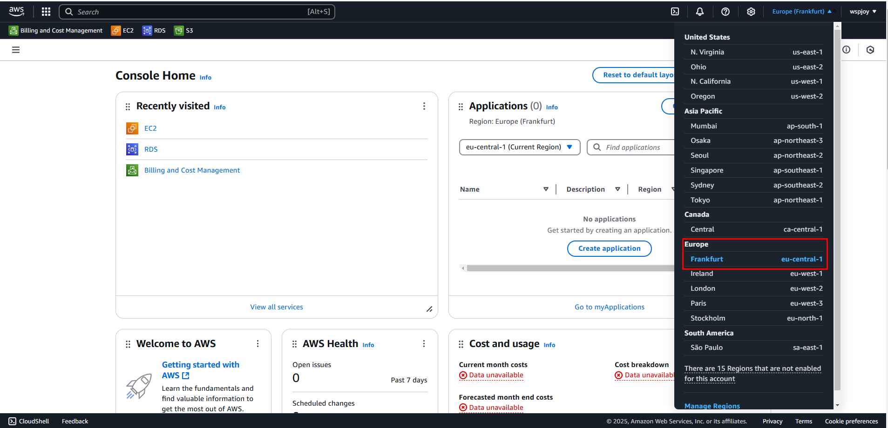

2. **Verify the Region URL:**
   - Once a region is selected, the URL will reflect your chosen region, for example:
     ```text
     https://eu-central-1.console.aws.amazon.com/console/home?region=eu-central-1
     ```

---

## Creating an EC2 Instance

1. **Navigate to EC2 Service:**
   - In the search bar, type `ec2` and add this service to your quick access panel.

   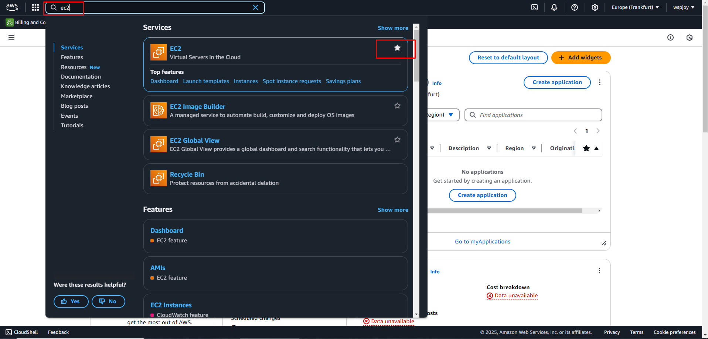

2. **Launch a New Instance:**
   - Click on the EC2 service in the quick access panel to start creating a virtual machine (instance).

   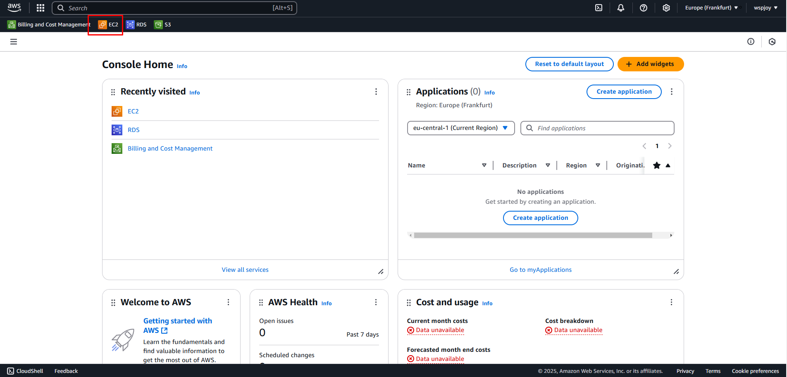

3. **Instance Management Page:**
   - You will be directed to the page where you can manage your virtual machines within the selected region. Remember, each data center within a region has its own set of virtual machines.

   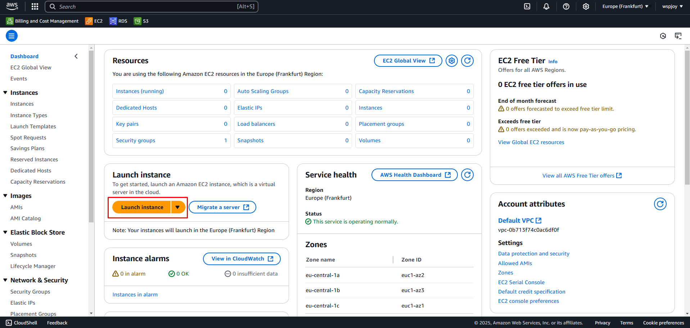

4. **Name and Tags:**
   - In the `Name and tags` section, enter a name for your virtual machine.

   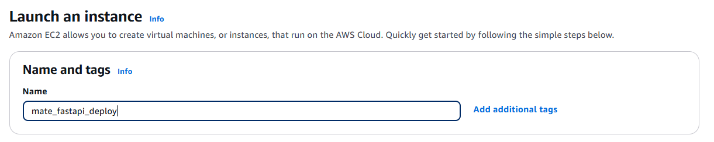

5. **Application and OS Images:**
   - Select `Ubuntu` and the image `Ubuntu Server 24.04 LTS (HVM)`. Ensure the `Free tier eligible` label is present to take advantage of free usage.

   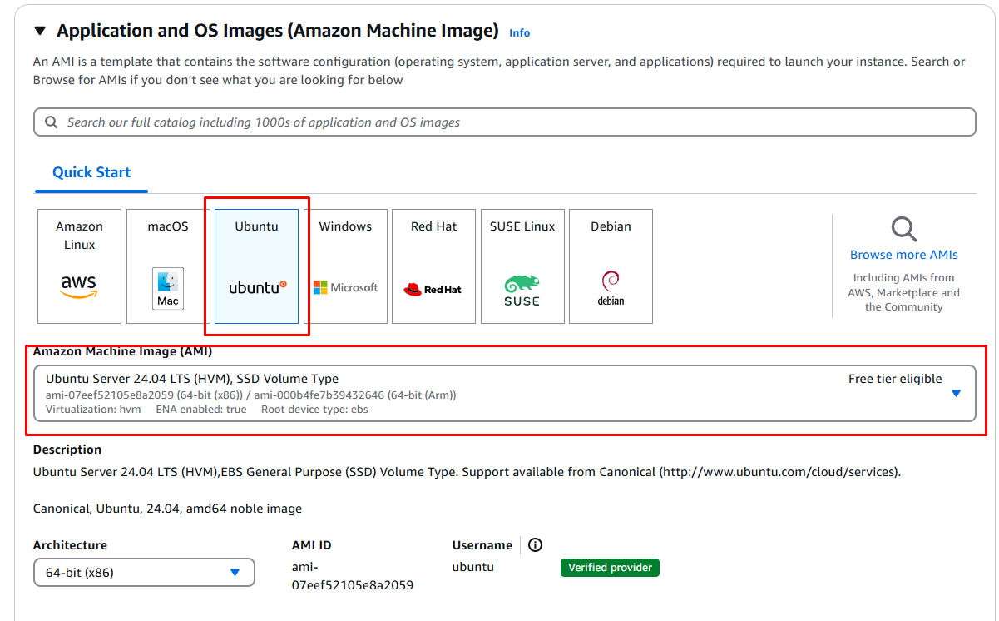

6. **Instance Type:**
   - Choose `t2.micro` in the `Instance type` section, again verifying the `Free tier eligible` label.

   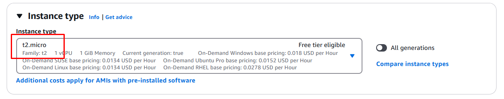

7. **Key Pair (Login):**
   - In the `Key pair (login)` section, click on `Create new key pair` to generate a key pair for remote access.

   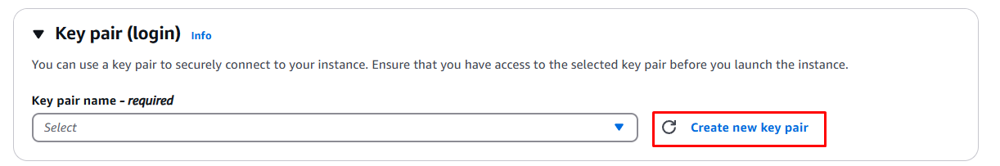

   **Steps to Create Key Pair:**
   1. **Name:** Enter a name for the key pair in the `Key pair name` field.
   2. **Type:** Select `RSA` as the key pair type.
   3. **Format:** Choose `.pem` as the private key file format.
   4. **Create:** Click `Create key pair` and save the key on your computer.

   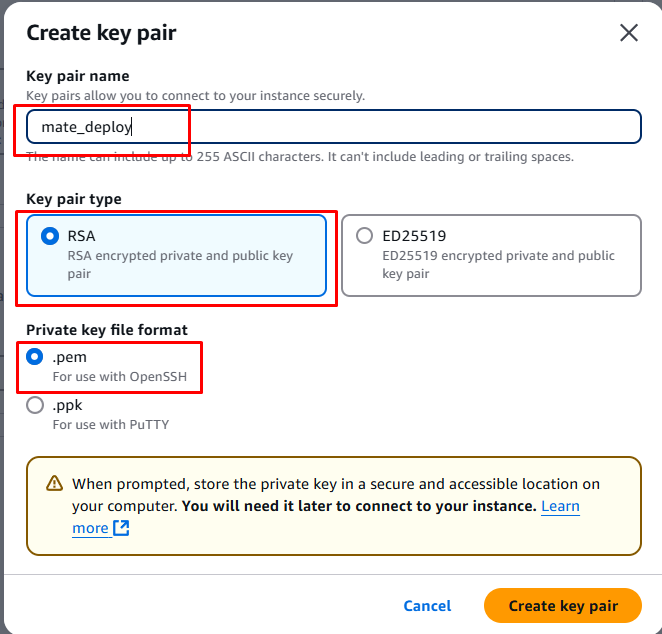

8. **Network Settings:**
   - Configure network settings as shown in the screenshot below.

   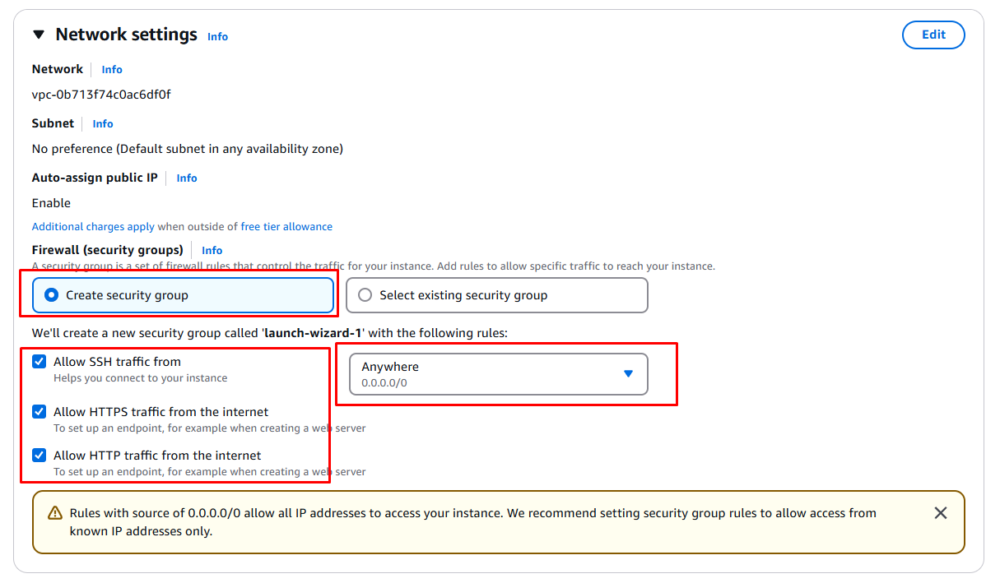

9. **Configure Storage:**
   - Set the maximum size for free storage. As of this guide's creation, the maximum free storage size is `30 GB`.

   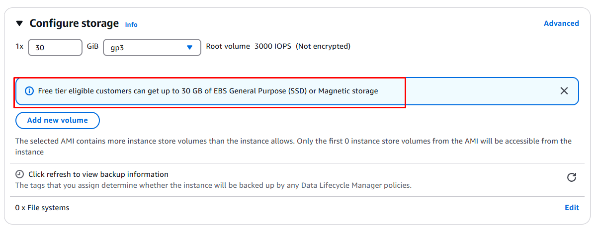

10. **Launch Instance:**
    - In the `Summary` section, click the `Launch instance` button to finalize the creation of your EC2 instance.

    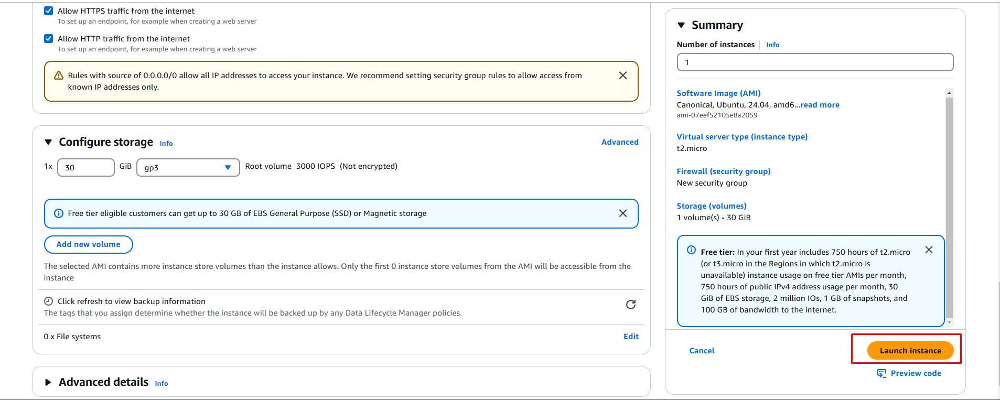

11. **View Instances:**
    - Click on the `Instances` link to view the list of your virtual machines.

    

12. **Instance Status:**
    - Initially, the `Status check` will show as `Initializing`. After a short period, it will change to `Running`, indicating that the virtual machine is operational.

    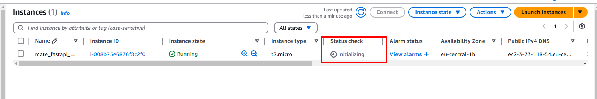

    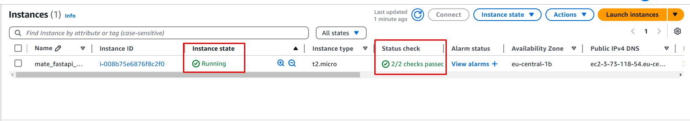

---

## Optional EC2 Settings

After creating the EC2 instance, the following ports are open by default: **22 (SSH), 80 (HTTP), 443 (HTTPS)**. If you need to open additional ports, such as **9001** for the `minio` web interface, follow these steps:

1. **Access Security Groups:**
   - Select `EC2` in the AWS console.
   - Click on the `Security` tab and then on the link under `Security groups`.

   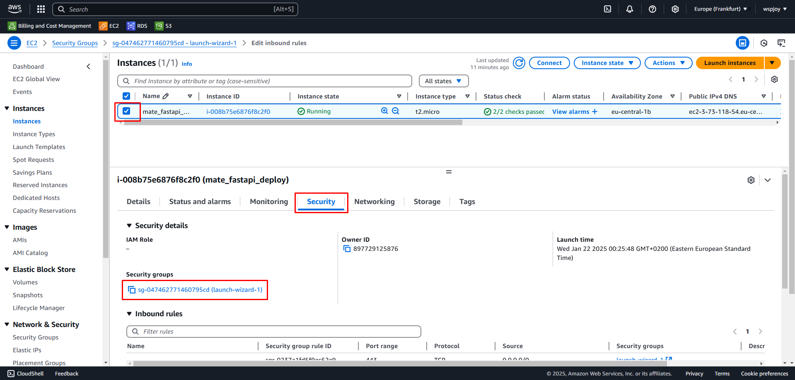

2. **Edit Inbound Rules:**
   - Click the `Edit inbound rules` button.

   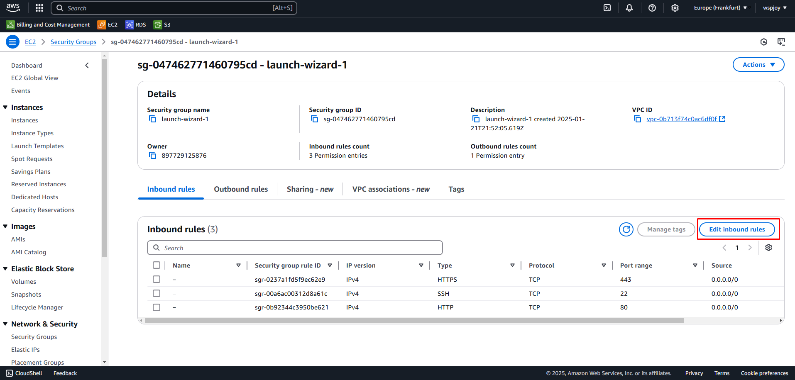

3. **Add New Port:**
   - Click on `Add rule`, specify the necessary port (e.g., **9001**), set the protocol (typically `TCP`), and define the source (preferably restricted to specific IPs for security).

   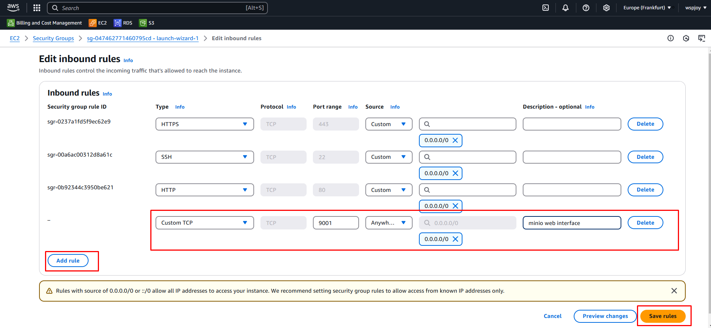

4. **Save Rules:**
   - Click `Save rules` to apply the changes.

   **Note:** After restarting the EC2 instance, a new IP address will be assigned. To maintain a consistent external IP, proceed to set up an Elastic IP.

---

## Assigning a Static IP Address (Elastic IP)

1. **Navigate to Elastic IPs:**
   - Return to the EC2 management homepage.
   - Select `Elastic IPs`.

   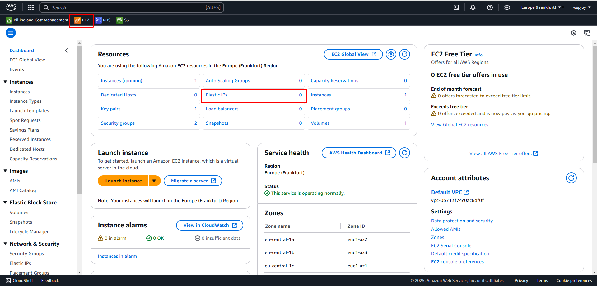

2. **Allocate Elastic IP Address:**
   - Click the `Allocate Elastic IP address` button.

   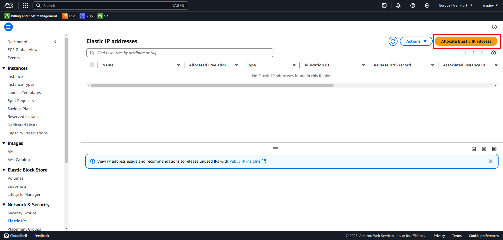

3. **Select Network Border Group:**
   - Choose the network border group corresponding to your EC2 instance's region.
   - Click `Allocate`.

   

4. **Associate Elastic IP:**
   - Select the newly created IP address.
   - Click on `Actions` and choose `Associate Elastic IP address`.

   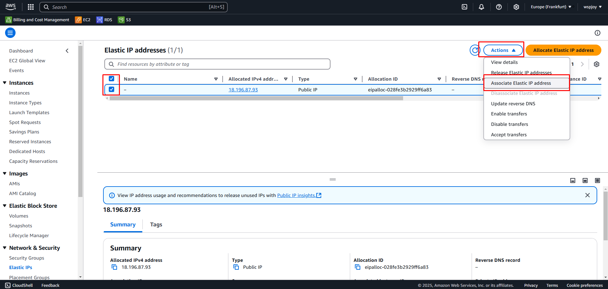

5. **Bind to EC2 Instance:**
   - Select your EC2 instance and its private IP.
   - Click `Associate`.

   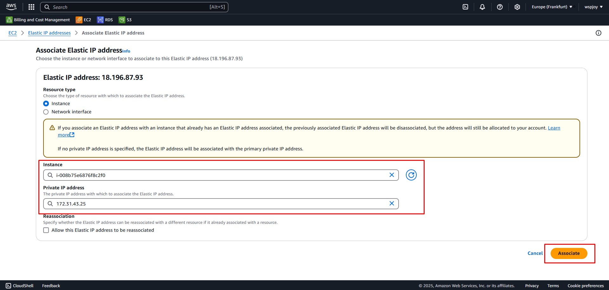

6. **Verify Association:**
   - Go back to the `Instances` list.
   - Ensure that the public IP of your EC2 instance matches the Elastic IP you just created.

   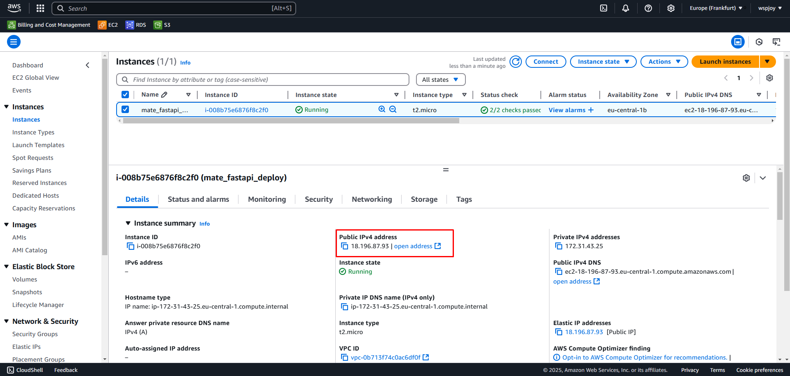

   **Benefit:** Your EC2 instance will retain this public IP address even after reboots.

---

## Connecting to Remote EC2

1. **Download and Install MobaXterm:**
   - [Download MobaXterm](https://mobaxterm.mobatek.net/download.html)

2. **Open MobaXterm and Start a New Session:**
   - Click the `Session` button.

   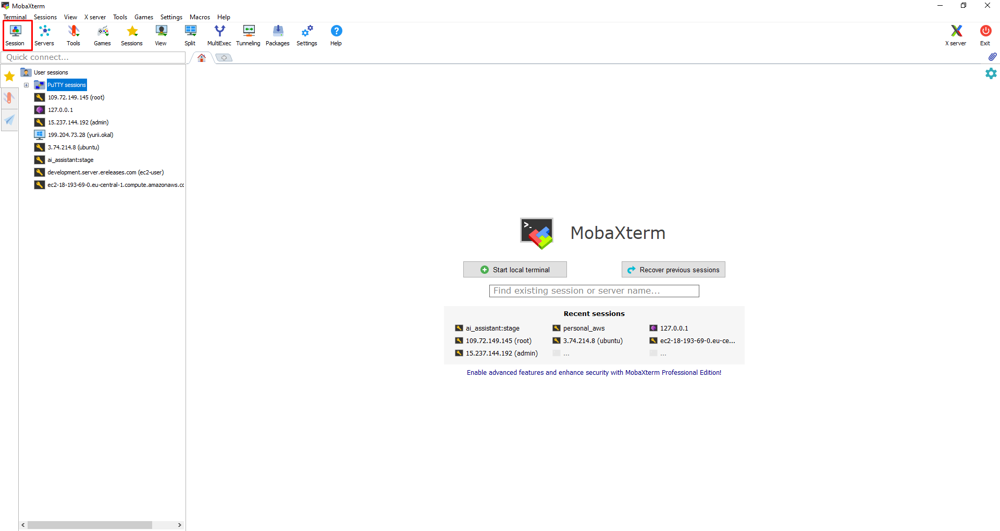

3. **Configure SSH Connection:**
   - Select `SSH`.
   - In the `Remote host` field, enter the public IP of your EC2 instance.
   - Check `Use private key` and specify the path to your `.pem` key file.

   

4. **Create a Bookmark (Optional):**
   - For convenience, assign a name to this connection.

   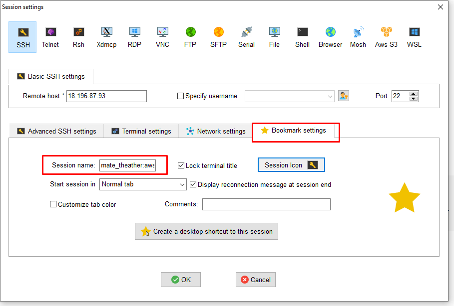

5. **Connect to EC2 Instance:**
   - In the sidebar bookmarks, select your connection.
   - When prompted for `login`, enter `ubuntu` (default user for Ubuntu-based EC2 instances).
   - Press `Enter` to access the remote terminal.

   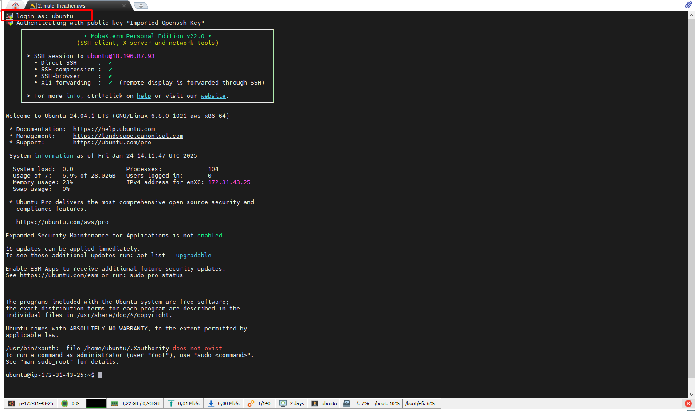

---

## Configuring Linux Before Launching the Project

Since a free EC2 instance typically comes with only **1GB of RAM**, it's essential to create a swap file to enhance system performance. Follow the steps below to set up a **4GB swap file**.

### Step 1: View Block Devices and Partitions

1. **List Block Devices:**
   ```bash
   lsblk
   ```
   **Comment:** This command displays information about all available block devices and their partitions. Look for the root (`/`) partition.

   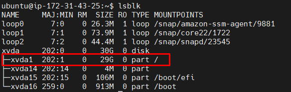

### Step 2: Check Free Disk Space

1. **Display Disk Space:**
   ```bash
   df -h
   ```
   **Comment:** This command shows the disk space usage in a human-readable format. Ensure there's at least **4GB** of free space.

   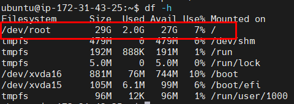

### Step 3: Create Swap File

1. **Create Swap File Using `fallocate`:**
   ```bash
   sudo fallocate -l 4G /swapfile
   ```
   **Comment:** This command quickly creates a 4GB file named `/swapfile` to be used as swap space.

   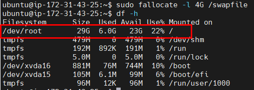

   **Alternative Method Using `dd`:**
   If `fallocate` is not available or fails, use `dd`:
   ```bash
   sudo dd if=/dev/zero of=/swapfile bs=1M count=4096
   ```

### Step 4: Set Correct Permissions for Swap File

1. **Change File Permissions:**
   ```bash
   sudo chmod 600 /swapfile
   ```
   **Comment:** Sets the file permissions so that only the root user can read and write to the swap file, enhancing security.

2. **Verify Permissions:**
   ```bash
   ls -la /swapfile
   ```
   **Comment:** Ensure that only the `root` user has access to the swap file.

   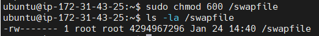

### Step 5: Format the Swap File

1. **Set Up Swap Area:**
   ```bash
   sudo mkswap /swapfile
   ```
   **Comment:** Formats the `/swapfile` as a swap area.

   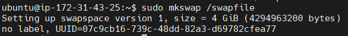

### Step 6: Enable the Swap File

1. **Activate Swap:**
   ```bash
   sudo swapon /swapfile
   ```
   **Comment:** Enables the swap file, making it available for the system to use.

### Step 7: Verify Swap Status

1. **Check Swap Usage:**
   ```bash
   sudo swapon --show
   ```
   **Or:**
   ```bash
   free -h
   ```
   **Comment:** These commands display the current swap usage and confirm that the swap file is active.

   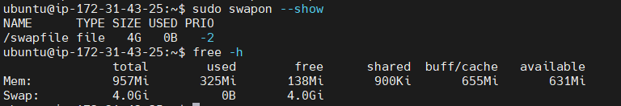

### Step 8: Configure Swap to Persist After Reboot

1. **Backup `/etc/fstab`:**
   ```bash
   sudo cp /etc/fstab /etc/fstab.bak
   ```
   **Comment:** Creates a backup of the `fstab` file before making changes.

2. **Edit `/etc/fstab`:**
   ```bash
   sudo nano /etc/fstab
   ```
   **Comment:** Opens the `fstab` file in the Nano editor. If Nano isn't installed, you can use `vim` or another editor.

3. **Add Swap Entry:**
   - Add the following line at the end of the file:
     ```
     /swapfile none swap sw 0 0
     ```
   **Comment:** This line ensures that the swap file is enabled at boot.

4. **Save and Exit:**
   - In Nano, press `Ctrl + O` to save and `Ctrl + X` to exit.

5. **Apply Changes:**
   ```bash
   sudo mount -a
   ```
   **Comment:** Mounts all filesystems mentioned in `fstab` to ensure there are no errors.

6. **Confirm Swap is Active:**
   ```bash
   sudo swapon --show
   ```
   **Or:**
   ```bash
   free -h
   ```

---

## Installing Docker Engine

Follow the official Docker installation instructions to set up Docker on your EC2 instance.

[Docker Installation Guide](https://docs.docker.com/engine/install/ubuntu/#install-using-the-repository)

### Step 1: Set Up Docker’s APT Repository

1. **Update Package Index and Install Prerequisites:**
   ```shell
   sudo apt-get update
   sudo apt-get install -y ca-certificates curl
   ```
   **Comment:** Updates the package index and installs necessary packages for adding Docker’s repository.

2. **Create Docker’s Official GPG Key Directory:**
   ```shell
   sudo install -m 0755 -d /etc/apt/keyrings
   ```
   **Comment:** Creates a directory to store Docker's GPG key securely.

3. **Add Docker’s GPG Key:**
   ```shell
   sudo curl -fsSL https://download.docker.com/linux/ubuntu/gpg -o /etc/apt/keyrings/docker.asc
   sudo chmod a+r /etc/apt/keyrings/docker.asc
   ```
   **Comment:** Downloads Docker's official GPG key and sets appropriate permissions.

4. **Add Docker Repository to APT Sources:**
   ```shell
   echo \
     "deb [arch=$(dpkg --print-architecture) signed-by=/etc/apt/keyrings/docker.asc] https://download.docker.com/linux/ubuntu \
     $(. /etc/os-release && echo "$VERSION_CODENAME") stable" | \
     sudo tee /etc/apt/sources.list.d/docker.list > /dev/null
   ```
   **Comment:** Adds the Docker repository to your system's APT sources list.

5. **Update Package Index Again:**
   ```shell
   sudo apt-get update
   ```
   **Comment:** Refreshes the package database to include Docker packages.

### Step 2: Install Docker Packages

1. **Install Docker Engine and Related Components:**
   ```shell
   sudo apt-get install -y docker-ce docker-ce-cli containerd.io docker-buildx-plugin docker-compose-plugin
   ```
   **Comment:** Installs Docker Community Edition, CLI, containerd, and Docker plugins for buildx and compose.

### Step 3: (Optional) Install Docker Compose

Although Docker Compose is included as a plugin, you can install it separately if needed:

```shell
sudo apt install -y docker-compose
```

**Comment:** Ensures Docker Compose is installed as a standalone tool.

### Step 4: Verify Docker Installation

1. **Run Hello-World Container:**
   ```shell
   sudo docker run hello-world
   ```
   **Comment:** This command pulls and runs a test Docker image to verify that Docker is installed correctly.

---

## Adding User to Docker Group

Adding your user to the `docker` group allows you to run Docker commands without needing to prepend `sudo` each time. This simplifies Docker usage but grants elevated privileges, so proceed with caution.

### Step 1: Check if Docker Group Exists

1. **Check for Docker Group:**
   ```bash
   getent group docker
   ```
   **Comment:** Verifies if the `docker` group already exists on the system.

### Step 2: Create Docker Group (If Not Exists)

1. **Create Docker Group:**
   ```bash
   sudo groupadd docker
   ```
   **Comment:** Creates the `docker` group if it doesn't already exist.

### Step 3: Add User to Docker Group

1. **Add Current User to Docker Group:**
   ```bash
   sudo usermod -aG docker $USER
   ```
   **Comment:** Appends the current user to the `docker` group. Replace `$USER` with a specific username if adding a different user.

   **Alternative for Specific User:**
   ```bash
   sudo usermod -aG docker username
   ```

### Step 4: Apply Group Membership Changes

1. **Log Out and Log Back In:**
   - **Option 1:** Disconnect and reconnect via SSH.
   - **Option 2:** Use the following command to refresh group memberships without logging out:
     ```bash
     newgrp docker
     ```

### Step 5: Verify Group Membership

1. **Check Groups for Current User:**
   ```bash
   groups
   ```
   **Comment:** Ensures that the `docker` group is listed among the user's groups.

   **Expected Output:**
   ```
   username docker
   ```

### Step 6: Test Docker Command Without `sudo`

1. **Run Hello-World Container:**
   ```bash
   docker run hello-world
   ```
   **Comment:** Confirms that Docker commands can be executed without `sudo`.

   **Expected Output:**
   ```
   Hello from Docker!
   This message shows that your installation appears to be working correctly.
   ...
   ```

**Security Note:** Adding a user to the `docker` group grants them elevated privileges equivalent to the `root` user. Ensure that only trusted users are added to this group.

---

## Cloning the Repository and Launching the Project

1. **Navigate to Home Directory and Verify Location:**
   ```shell
   # Change to user home directory
   cd ~

   # Display current directory
   pwd
   ```
   **Comment:** Ensures you are in the home directory before creating new directories.

2. **Create and Enter `src` Directory:**
   ```shell
   # Create 'src' directory
   mkdir src

   # Navigate into 'src' directory
   cd src
   ```
   **Comment:** Organizes your project files within the `src` directory.

3. **Clone Your Repository and Enter Its Directory:**
   ```shell
   # Clone your repository
   git clone <your_repository_url>

   # Navigate into the repository folder
   cd <your_repository_folder_name>
   ```
   **Comment:** Replace `<your_repository_url>` with the actual URL of your Git repository and `<your_repository_folder_name>` with the cloned folder's name.

4. **Create `.env` Files:**
   - **Main Project Directory:**
     ```shell
     cp .env.sample .env
     ```
   - **Nginx Configuration Directory:**
     ```shell
     cp docker/nginx/.env.sample docker/nginx/.env
     ```
   **Comment:** Copies sample environment files to actual `.env` files. Update these files with your configuration details, including login credentials for Nginx documentation authentication.

5. **Build and Launch Docker Containers:**
   ```shell
   sudo docker-compose -f docker-compose-prod.yml up --build
   ```
   **Comment:** Builds and starts the Docker containers as defined in the `docker-compose-prod.yml` file.

6. **Access the Application:**
   - Open your browser and navigate to the public IP address of your EC2 instance without specifying a port (as it's running on port 80).
   - You will be prompted to enter the login and password specified in `docker/nginx/.env`.

   

7. **Run Docker Compose in Detached Mode:**
   ```shell
   sudo docker-compose -f docker-compose-prod.yml up -d
   ```
   **Comment:** Runs the Docker containers in the background, freeing up the terminal.

8. **View Logs:**
   ```shell
   sudo docker-compose -f docker-compose-prod.yml logs
   ```
   **Comment:** Displays the logs from the running Docker containers for monitoring and debugging purposes.

---

## Conclusion

By following this guide, you have successfully deployed your project on an AWS EC2 instance. The steps covered include:

1. **Registering and Setting Up AWS:**
   - Creating an AWS account.
   - Selecting the appropriate region.

2. **Launching an EC2 Instance:**
   - Configuring instance details.
   - Setting up security groups and Elastic IP for a static public IP.

3. **Configuring the EC2 Instance:**
   - Connecting via SSH using MobaXterm.
   - Setting up swap space to enhance performance.
   - Installing Docker and Docker Compose.
   - Managing Docker permissions for ease of use.

4. **Deploying Your Project:**
   - Cloning your repository.
   - Configuring environment variables.
   - Building and running Docker containers.
